# ABA-013VIR 사용법

# Setting

- 준비물
    - 윈도우 OS 설치가 되어있고 랜선 연결이 가능한 컴퓨터
    - Visual Studio 개발 환경 설치(C++ 등)
    - 할로겐 등

### 설치

1. 설치 파일 다운로드
    
     영상을 먼저 정독을 한 후에 전반적인 설치 방법에 대해 이해를 진행한다.
    
    그 후
    
    `AZP-ACAPTF-01_V1190` 폴더안에 있는 `AvalSetup.exe` 파일을 실행하여 설치를 진행한다
    
    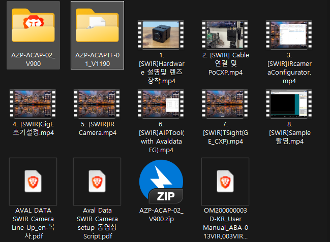
    

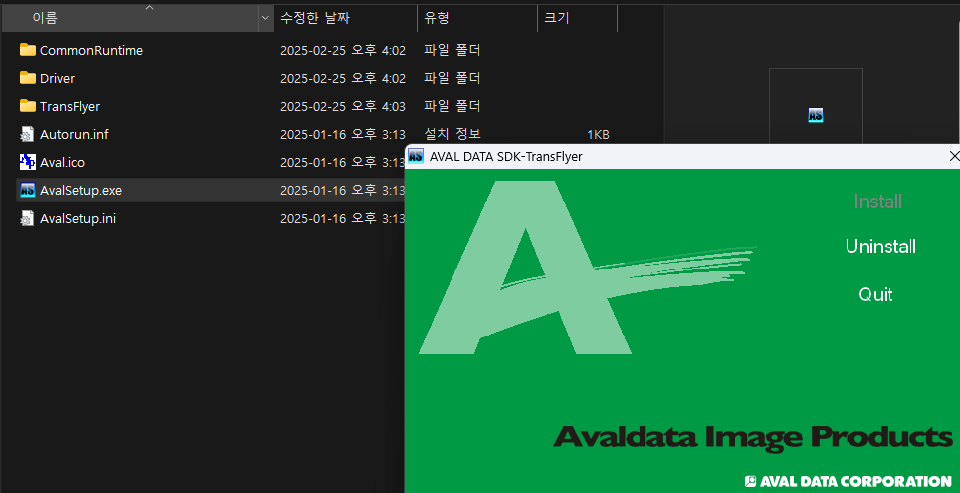

제품 이름 : ABA-013VIR

제품키 : ACL2-6D6A-8923-93FE

1. 설치를 진행한 후에 C드라이브 안에 있는 Program Files안에  AVAL DATA 폴더가 생성됨을 확인하고 바탕화면에 AVAL DATA TSight, IRcamera 응용프로그램이 보이는지 확인한다. 확인이 되었다면 카메라 전용 프로그램을 사용할 준비가 되어있다는 의미이다.

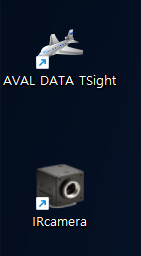

# 카메라 활용법

### 전용 소프트웨어 사용

### IRcamera

IRcamera 응용프로그램 같은 경우 어떤 식으로 데이터를 받아들일지 Gain을 설정할지를 설정할 수 있다. 

정상적으로 카메라를 연결하였다면 IRcamera를 실행시킬 수 있다.

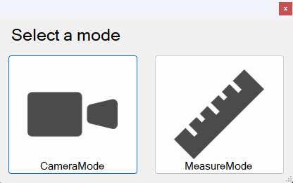

CameraMode로 접근하게 되면 아래와 같은 인터페이스를 보게 된다

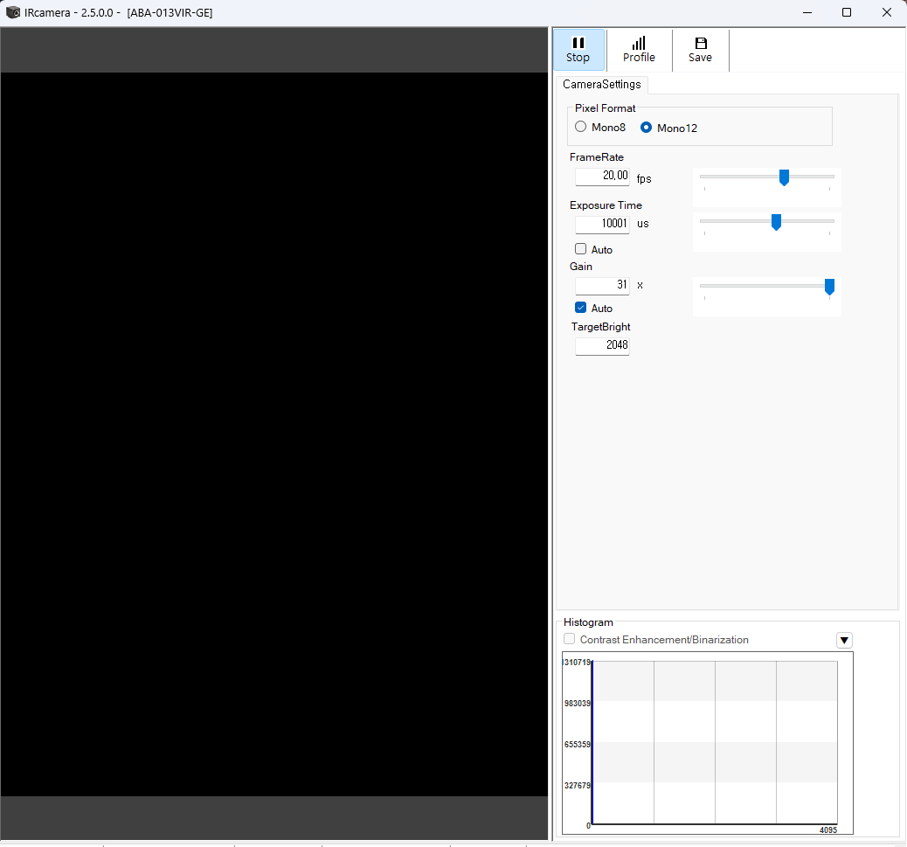

ABA-013VIR 스펙시트를 참고하면 확인 할 수 있지만 설정할 수 있는 옵션들이 존재한다.

1. 읽어들이는 데이터의 크기 : 8bit, 12bit → 1pixel에 해당 하는 값을 0~255로 표현할지 0~4096으로 표현할지를 선택할 수 있다.
2. FrameRate : FPS다. 읽어들이는 데이터의 크기에 따라 최대 FPS가 결정된다. 8bit로 설정된 경우  60fps까지 가능하고 12bit로 설정되어있으면 30fps까지 가능하다
3. Exposure Time : 노출시간을 설정 할 수는 있지만 FPS에 한계가 생기기에 설정하지 않음을 추천한다.
4. Gain : 읽어들이는 값의 크기를 조절하는 값이다. 화면이 어둡다면 Gain 값을 올려 임의로 밝게 만들 수 있다. (Ex 0~255 scale에서 15의 값을 가질 때에 Gain을 2배로 증가시키면 30의 값을 가져 화면이 밝아지게 만든다)
    
    Gain을 너무 크게 증가 시킬 경우 노이즈 또한 증폭이 되기 때문에 제대로 된 데이터를 읽기 힘들 수도 있다. 외부로 부터 입력되는 할로겐 등의 빛 세기를 증가 시키는 것이 더 도움이 될 때가 있다.
    
    Auto 체크박스에 체크를 할 경우 TargetBright에 맞추어 밝기를 조절 할 수 있게 된다.
    

전용 소프트웨어에서 이러한 값들을 설정한 후에 프로그램을 종료하면 설정 값이 다음 연결 전까지 유지가 된다. C++코드로 데이터를 가공하기 위해서는 데이터 사이즈 등이 매우 중요하기에 설정 값을 확인한 후에 코드를 작성하도록 하자.

### 코드 작성

추가적인 개발을 진행하기 위해서는 코드로 카메라로부터 데이터를 읽어오고 쓸 수 있어야 한다. 

설치를 진행했던 폴더로 돌아가면 `AZP-ACAPTF-01_V1190/`TransFlyer/Examples/C++ 에 예시 코드가 존재한다.

Visual Studio 솔루션 파일로 작성되어있기 때문에 전체 폴더를 프로젝트의 형식으로 불러오고 실행 시키면 된다. 

(*******매우 중요********) 다만 실행을 시킬 때의 **Visual Studio SDK 버전을 8.1**로 설정 해야 한다

[Visual Studio SDK 8.1 다운 링크](https://developer.microsoft.com/en-us/windows/downloads/sdk-archive/index-legacy)

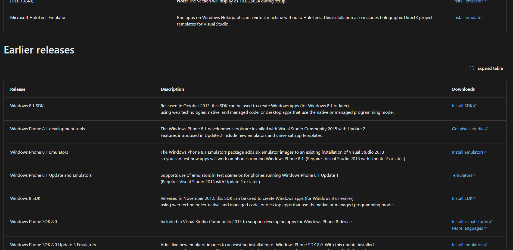

설치가 완료가 되면 Visual Studio에서 솔루션 파일을 열어 프로젝트를 구성한 후에 솔루션 대상 변경을 통해 설치할 때의 최근 SDK가 아니라(2025-07-18 기준 10.0) 8.1 로 설정한 후에 

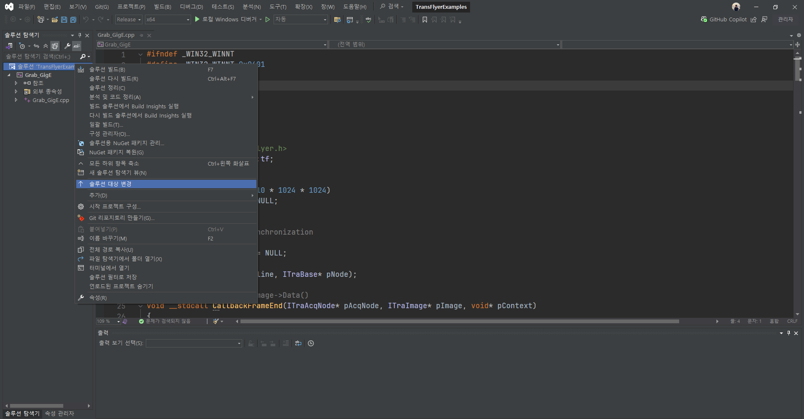

코드를 수정하며 프로그램을 작성 및 실행하면 된다.

예시 코드 중에서 Grab, Event 파일들을 참고하여 데이터를 읽어오고 이벤트가 있을 때에 Grab하는 코드들을 보며 작성하면 된다.

추가적으로 Grab_GigE 파일을 참고하여 쉐어드 메모리로 데이터를 저장하는 역할을 수행하는 C++코드와 이를 사용하여 작성한 exe파일을 사용하여 이미지를 저장하는 python 파일도 첨부한다.
8bit, 60fps로 설정 후에 코드를 실행시키면 된다. 

# 실험 환경

SWIR 카메라는 가시광선 외에 근적외선 파장 대역의 데이터를 입력 받기 때문에 근적외선 파장대역까지 출력하는 “할로겐등”이 필요하다.

물질별로 흡수 스펙트럼이 다르기 때문에 같은 에너지(빛)을 받았을 때의 반사율이 달라 육안으로는 분류가 힘든 것들을 분류할 수 있게 된다.

물질별로 어떤  흡수 스펙트럼 대역을 볼지는 카메라 앞에 렌즈필터(longpass filter, shortpass filter, bandpass filter)를 장착하여 원하는 대역의 반사율을 측정하면 된다.

주의 해야 할 점은 

1. 할로겐등이 피사체에 최대한 고르게 빛을 비춰주고 있어야 한다. 특정 부분에만 빛이 강하게 비춰질 경우 카메라로 입력되는 값이 물체의 특성에 의한 것인지, 빛이 부분적으로 세게 들어와 반사가 강하게 된 것인지 판단하기가 힘들다.
    
    → 이를 해결하기 위해 할로겐등의 각도를 사선으로 비추도록 하였고 디퓨즈 렌즈를 할로겐 등 앞에 설치하였다.
    
2. 렌즈필터
    
    실험실에 구비된 렌즈필터들을 Edmund Optics에서 구매한 High Performance OD 4.0 필터들이 많다.
    
    이 렌즈 필터들의 스펙시트를 보게 되면 카메라의 스펙인 400~1700nm대역을 모두 커버하는 자료가 아님을 볼 수 있다.
    
    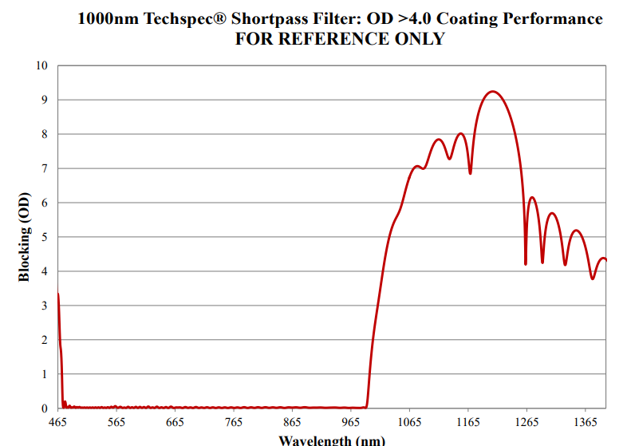
    
    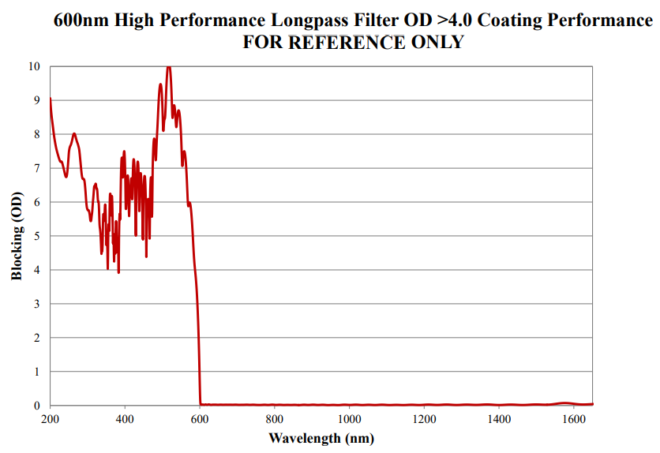
    

(예시 스펙시트)

문의를 한 결과 스펙시트에서 표기되지 않은 영역 같은 경우 Block을 제대로 하지 않는 경우가 존재한다고 문의를 받았고, 실제로 실험을 진행했을 때에 어떤 렌즈 필터를 사용하던 간에 1600~1700nm 대역 데이터가 존재함을 확인하였다. 그렇기에 실제로 실험을 진행 할 수 있는 렌즈 필터의 대역을 먼저 선정하는 것이 필요하다.

아래는 PVC, PC, AC 플라스틱들을 분류하기 위해 실험 한 결과이다

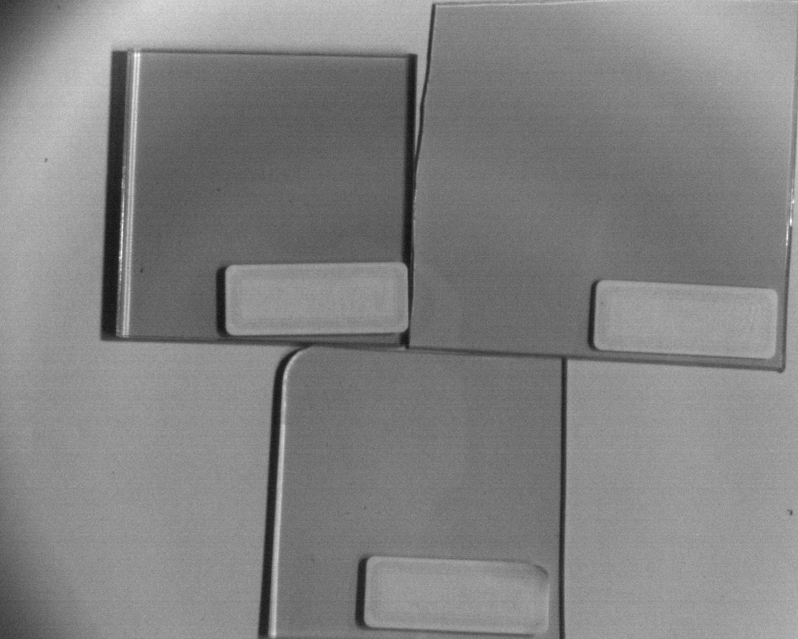

1050 shortpass와 1300 longpass 를 사용한 결과 → 원래라면 아무것도 보이지 않아야 하지만 이미지가 Grab되었다.

 

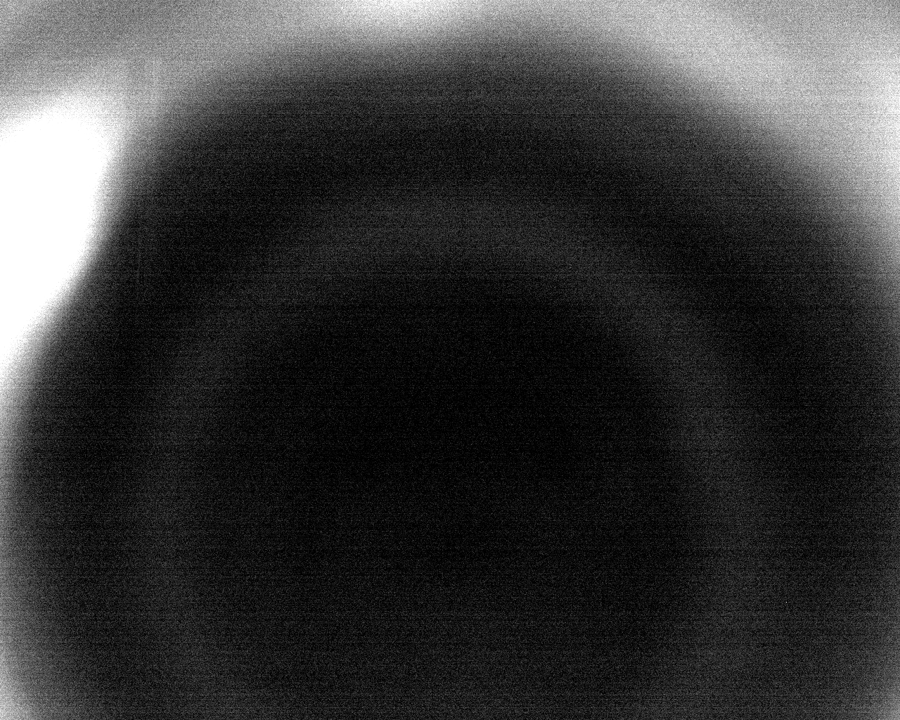

1300 longpass와 1300 shortpass를 사용한 경우 확실히 상이 보이지 않는 것을 볼 수 있다.

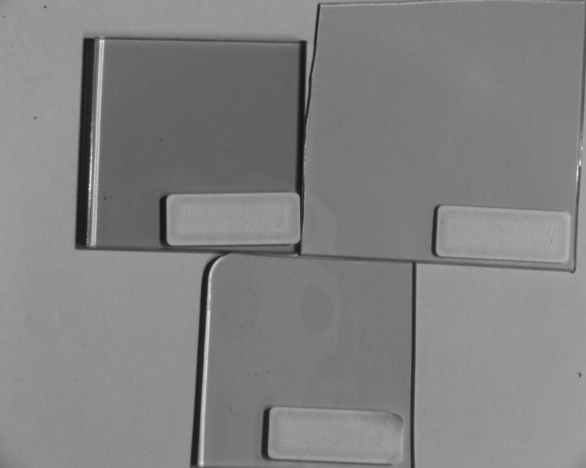

1300 Longpass만 적용하였을 때이다. 처음 실험 결과와 비교하였을 때에 전체적인 밝기의 차이만 존재함을 확인 할 수 있었다.

# 끝으로
육안으로 구분이 불가능하지만 근적외선 대역에서 분류가 가능한 주제를 찾기 위해서 액체(물, 아세톤, 알코올 등), 투명 플라스틱(PVC, PC, AC 등) 등 중 플라스틱을 분류하려 했으나 0~255 scale에서 최대 25정도의 차이만 가지고 있기에 할로겐 등의 각도와 카메라 각도등에 따라 구분하기가 힘듦을 경험 하였다. 
조명의 각도, 카메라의 각도등과 물체를 선정하여 추가적인 실험을 진행하면 좋을 것 같다.